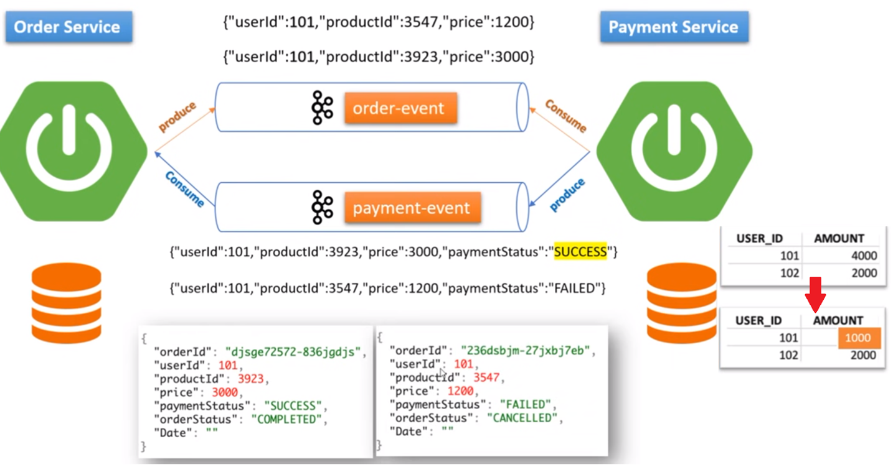
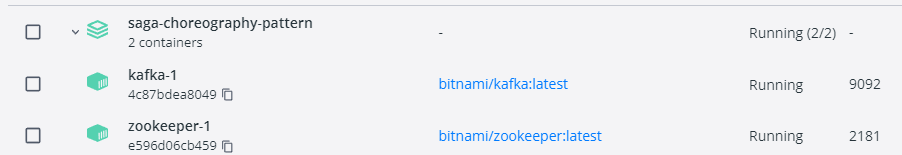
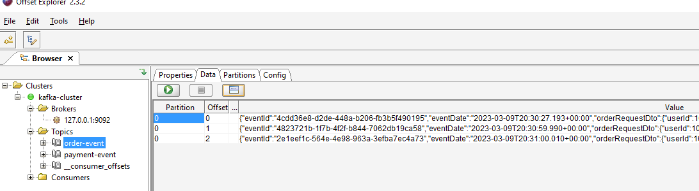
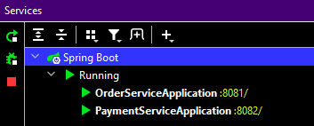

# saga-choreography-example



# Apache Kafka
https://hub.docker.com/r/bitnami/kafka
docker-compose
```yaml
version: "3"
services:
  zookeeper:
    image: 'bitnami/zookeeper:3.7.2-debian-11-r6'
    ports:
      - '2181:2181'
    environment:
      - ALLOW_ANONYMOUS_LOGIN=yes
  kafka:
    image: 'bitnami/kafka:3.7.0-debian-12-r3'
    ports:
      - '9092:9092'
    environment:
      - KAFKA_BROKER_ID=1
      - KAFKA_CFG_LISTENERS=PLAINTEXT://:9092
      - KAFKA_CFG_ADVERTISED_LISTENERS=PLAINTEXT://127.0.0.1:9092
      - KAFKA_CFG_ZOOKEEPER_CONNECT=zookeeper:2181
      - ALLOW_PLAINTEXT_LISTENER=yes
    depends_on:
      - zookeeper
```

run: docker-compose up



##
Kafka tool: https://www.kafkatool.com/

- with this tool we can monitor messages in the topics.
- install the tool and connect to the kafka cluster
- Porperties: select json and update
- click on the green arrow to load the messages.



## Run the microservices:
- order service
- payment service



Now we can test the saga pattern:

PaymentService initializes some data (it uses local MySQL server)
```java
@PostConstruct
public void initUserBalanceInDB() {
        userBalanceRepository.saveAll(Stream.of(
        new UserBalance(101, 5000),
        new UserBalance(102, 3000),
        new UserBalance(103, 4200),
        new UserBalance(104, 20000),
        new UserBalance(105, 999)).collect(Collectors.toList()));
        }
```


## request
File httpRequests.http:
```http request
POST http://localhost:8081/order/create
Content-Type: application/json

{
  "userId": 103,
  "productId": 33,
  "amount": 4000
}
```
## Kafka payload

### Happy scenario
```bash
{"eventId":"b0e47448-eeb8-4cf4-bd29-b3a4315fc592","date":"2021-09-03T17:26:46.777+00:00","orderRequestDto":{"userId":103,"productId":33,"amount":4000,"orderId":1},"orderStatus":"ORDER_CREATED"}
```

```bash
{"eventId":"c48c5593-9f81-4ab4-9de8-b9fca2d2bef2","date":"2021-09-03T17:26:51.989+00:00","paymentRequestDto":{"orderId":1,"userId":103,"amount":4000},"paymentStatus":"PAYMENT_COMPLETED"}
```

## Request
```http request
POST http://localhost:8081/order/create
Content-Type: application/json

{
  "userId": 103,
  "productId": 12,
  "amount": 800
}
```

### insufficent funds
```bash
{"eventId":"fecacc77-017d-49cd-bdfa-58e47170da49","date":"2021-09-03T17:28:23.126+00:00","orderRequestDto":{"userId":103,"productId":12,"amount":800,"orderId":2},"orderStatus":"ORDER_CANCELLED"}
```

```bash
{"eventId":"46378bbc-5d15-4436-bed1-c6f3ddb1dc31","date":"2021-09-03T17:28:15.940+00:00","paymentRequestDto":{"orderId":2,"userId":103,"amount":800},"paymentStatus":"PAYMENT_FAILED"}
```

```http request
GET http://localhost:8081/orders
Content-Type: application/json
```

## Response

```bash
[
    {
        "id": 1,
        "userId": 103,
        "productId": 33,
        "price": 4000,
        "orderStatus": "ORDER_COMPLETED",
        "paymentStatus": "PAYMENT_COMPLETED"
    },
    {
        "id": 2,
        "userId": 103,
        "productId": 12,
        "price": 800,
        "orderStatus": "ORDER_CANCELLED",
        "paymentStatus": "PAYMENT_FAILED"
    }
]
```

